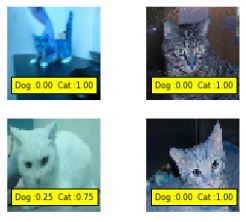
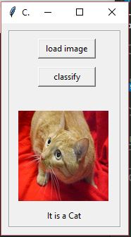
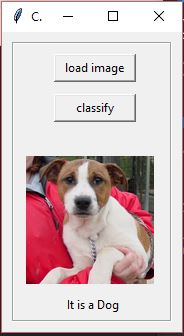

## Cat-Dog-Classification

         

This code is for the Kaggle contest given in the link below:
https://www.kaggle.com/c/dogs-vs-cats

  The basic task is to categorize cats and dogs into 2 different classes. I have used CNN (Convolutional Neural Network) to perform the task The final model used for notebook file has been used to obtained after some fine parameter tunning to the original model but the architecture of the model has been kept constant.

For details of the code check my Jupyter Notebook File [here](https://github.com/deepayanbardhan/Cat-Dog-Classification/blob/master/CatDog_Classifier.ipynb).

The model achitecture used is:

The output predictions are generated as a certain percentage belonging to a certain class and whichever is more we assign the image to the corresponding class. A sample of the outprediction is shown below:

I have also created an app of this classification which allows you to download the gui file and upload any images and it will give a prediction like shown below:

 | 

For the app file to compile the net.py file needs to run from which it fetches the model and gives the predictions.
